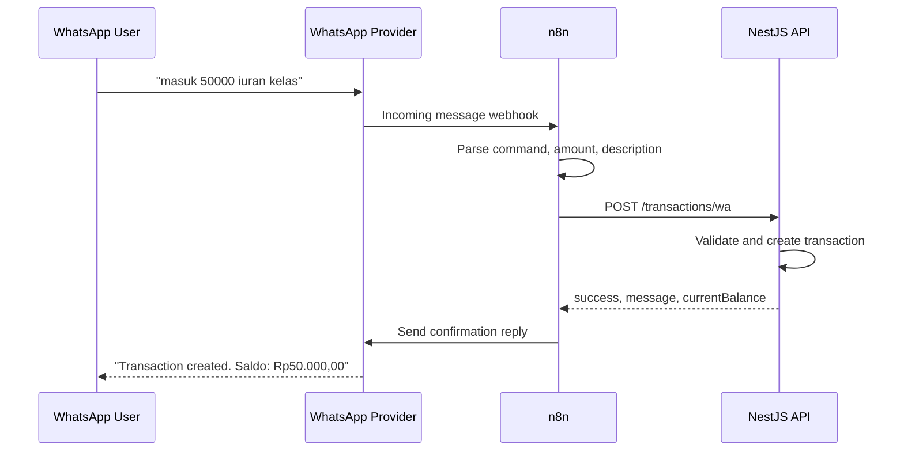
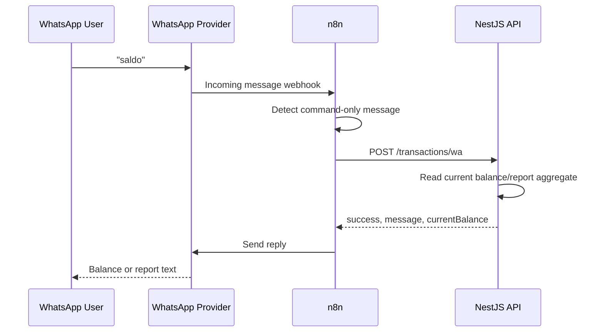

# WhatsApp + n8n Webhook Architecture

## Goal

Users send WhatsApp text commands such as:

```text
masuk 50000 iuran kelas
keluar 25000 beli konsumsi
```

n8n receives the WhatsApp webhook, normalizes the message, and calls the NestJS endpoint:

```text
POST /transactions/wa
```

Transaction responses follow this shape:

```json
{
  "success": true,
  "message": "Transaction created",
  "currentBalance": 1250000
}
```

## Components

- WhatsApp user: sends transaction and report commands.
- WhatsApp provider: forwards incoming messages to n8n. This can be WhatsApp Cloud API, Twilio, Wablas, Fonnte, or another provider.
- n8n workflow: owns webhook intake, message parsing, API forwarding, and optional WhatsApp reply.
- NestJS API: validates command payloads, records transactions, calculates current balance, and prepares response text.
- Storage layer: currently in-memory for demo purposes. Replace with a database repository before production.

## Webhook Architecture

1. WhatsApp provider receives an incoming user message.
2. Provider sends an HTTP webhook callback to n8n.
3. n8n extracts message text from provider-specific fields.
4. n8n parses the command into `{ message, command, amount, description }`.
5. n8n calls `POST /transactions/wa` on the NestJS backend.
6. NestJS validates and processes the command.
7. n8n receives `{ success, message, currentBalance }`.
8. n8n optionally sends a WhatsApp reply through the provider API.

## Supported Commands

| Command | Example | Backend behavior |
| --- | --- | --- |
| `masuk` | `masuk 50000 iuran kelas` | Add income and increase balance. |
| `keluar` | `keluar 25000 beli konsumsi` | Add expense and decrease balance. |
| `saldo` | `saldo` | Return current balance. |
| `laporan bulan ini` | `laporan bulan ini` | Return current month income, expense, and net balance. |
| `pengeluaran bulan ini` | `pengeluaran bulan ini` | Return current month expense total. |

## API Contract

Endpoint:

```text
POST /transactions/wa
Content-Type: application/json
```

Raw message request:

```json
{
  "message": "masuk 50000 iuran kelas"
}
```

Parsed n8n request:

```json
{
  "message": "keluar 25000 beli konsumsi",
  "command": "keluar",
  "amount": 25000,
  "description": "beli konsumsi"
}
```

Success response:

```json
{
  "success": true,
  "message": "Transaction created",
  "currentBalance": 25000
}
```

Validation failure example:

```json
{
  "message": "Invalid WhatsApp message. Use \"masuk 50000 iuran kelas\", \"keluar 25000 beli konsumsi\", or \"saldo\".",
  "error": "Bad Request",
  "statusCode": 400
}
```

## Sequence Diagram - Transaction



## Sequence Diagram - Balance and Reports



## Production Notes

- Add an API key or HMAC signature between n8n and NestJS.
- Store transactions in a database instead of process memory.
- Keep provider-specific webhook verification in n8n or behind an API gateway.
- Add idempotency using provider message IDs so retries do not create duplicate transactions.
- Add sender authorization before accepting financial commands.
